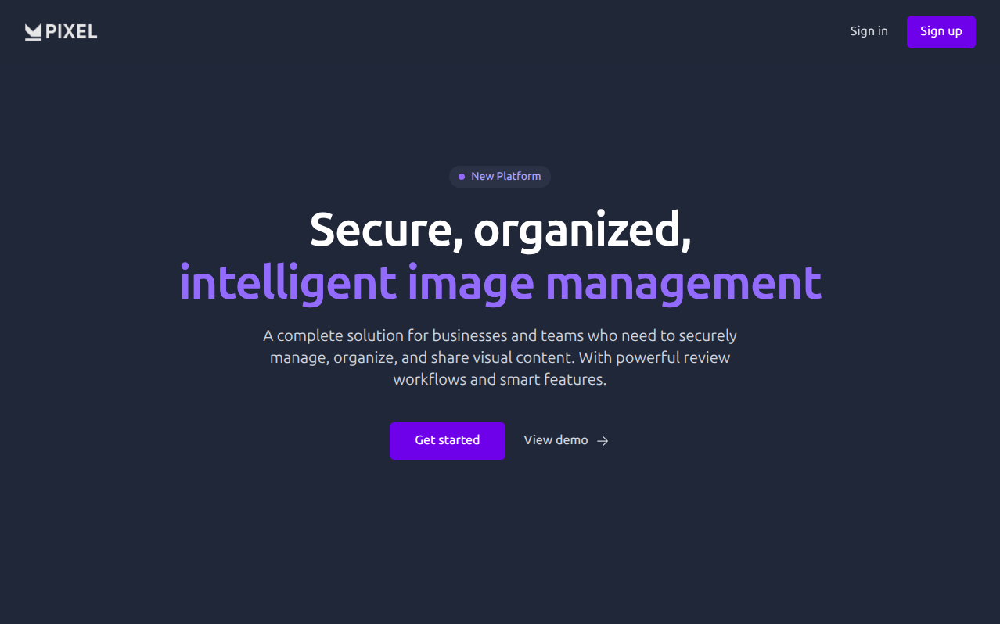

# 📸 PIXEL – Role-Based AI-Powered Image Gallery

**PIXEL** is a web-based, AI-assisted image gallery platform designed for secure, collaborative, and intelligent image management. It combines modern web technologies with machine learning to support role-based access, smart search (text and face-based), and scalable cloud storage.

## 👥 Team Information

- **Team Leader**: Gyanendra Singh – 0818CS221080
- **Team Member**: Prathit Dode – 0818CS221142
- **Team Member**: Kushagra Chavel – 0818CS221101
- **Branch/Year**: CSE – 3rd Year

## 🚀 Project Overview

In many collaborative environments like schools, media groups, and organizations, sharing and managing images is critical—but current tools like Google Drive or Dropbox fall short due to lack of role control and intelligent search.

**PIXEL** solves this with:

- **Role-based access control** (Uploader, Viewer)
- **Smart search** using AI (keyword and face-based retrieval)
- **Cloud-based image storage** (AWS S3)
- **Modern and responsive UI** for intuitive usage

## 🎯 Features

### 🔐 User & Role Management

- Admins/Uploader: Upload, delete, and categorize images
- Viewers: View and download images only
- Secure JWT-based authentication

### 🗂 Gallery Management

- Create and manage albums
- Image categorization by event/topic

### 🧠 Smart Search

- **Text-Based Search**: Find images using keywords (e.g., “white shirt”, “certificate”)
- **Face-Based Search**: Detect and retrieve images by matching facial features

### 📊 Admin Dashboard

- Monitor user uploads and activity
- View image counts and basic analytics

### 🔐 Approval workflows

- Moderation and approval workflows

## 📸 Screenshots

<br/><br>


## 🧰 Tech Stack

| Layer          | Technology                            |
| -------------- | ------------------------------------- |
| Frontend       | React.js, Tailwind CSS                |
| Backend        | Node.js (APIs), FastAPI (AI services) |
| Database       | PostgreSQL (Prisma ORM)               |
| Authentication | JWT                                   |
| AI/ML          | Face recognition, Face Embedding      |

## 🌐 Use Cases

- 📚 **Educational Institutes**: Share event and class photos securely
- 📰 **Media & News Teams**: Organize content by role and topic
- 🛠 **Project Teams**: Collaborate on visual assets with controlled access
- 🎉 **Event Management**: Categorize and retrieve images using face or keyword search

## 📦 Installation & Setup

### Prerequisites:

- Docker
- Node.js
- Python 3.10+
- PostgreSQL

### 1. Clone the Repository

```bash
git clone https://github.com/gyanendra-baghel/pixel.git
cd pixel
```

### 2. Setup Backend

```bash
docker compose up
```

### 4. Start Frontend

```bash
cd ./frontend
npm install
npm run dev
```

## 🔐 Authentication

PIXEL uses JWT for secure login and session management. Users are authenticated based on roles (Uploader, Viewer) and redirected accordingly.

## 📸 Smart Search Integration

- **Text-Based Search** uses tags and object detection models
- **Face-Based Search** matches uploaded faces with stored image data using facial embeddings

## 📈 Future Enhancements

- AI-based automatic image tagging
- Real-time collaborative album editing
- Mobile app support

## 🙌 Acknowledgements

We would like to thank our mentors, faculty, and peers for their continuous support and feedback throughout this project.
